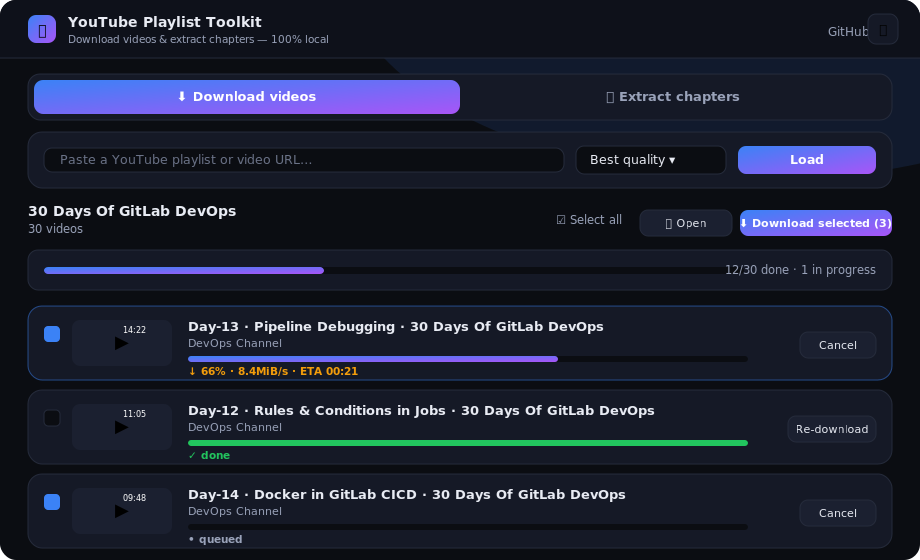

<div align="center">

# ⬇️ YouTube Playlist Downloader

**A tiny, dependency-free local web app to browse and download entire YouTube playlists — with a live, interactive UI.**

[](https://github.com/saadnadeem/yt-playlist-downloader/actions/workflows/ci.yml)
[](LICENSE)
[](https://www.python.org/)
[](#-requirements)
[](CONTRIBUTING.md)



</div>

---

Paste a YouTube **playlist** (or a single video) URL, see every video with thumbnails,
pick a quality, and download them **all**, a **selection**, or **one-by-one** — each with
a live progress bar. It runs entirely on your machine and binds to `127.0.0.1` only.

Under the hood it's a single Python file using **only the standard library**, shelling out
to the battle-tested [`yt-dlp`](https://github.com/yt-dlp/yt-dlp) binary (with
[`ffmpeg`](https://ffmpeg.org/) for merging).

## ✨ Features

- 🎬 **Playlist & single-video support** — paste any YouTube playlist or video link.
- 🎚️ **Quality picker** — Best, 1080p, 720p, 480p, or **Audio only (MP3)**.
- ☑️ **Multi-select** — checkboxes, *Select all*, and **Download selected**.
- ⏬ **Download all** or grab individual videos on demand.
- 📊 **Live progress** — per-video percentage, speed & ETA, plus an overall batch bar.
- ✋ **Cancel** any queued or in-progress download.
- 🔎 **Instant filter** to search within a long playlist.
- 🌗 **Light / dark theme** that remembers your choice.
- 📁 **Open folder** in your OS file manager (macOS, Windows, Linux).
- 🪶 **Zero Python dependencies** — just the standard library + `yt-dlp`/`ffmpeg`.

## 📋 Requirements

- **Python 3.9+**
- [**yt-dlp**](https://github.com/yt-dlp/yt-dlp) on your `PATH`
- [**ffmpeg**](https://ffmpeg.org/) on your `PATH` (needed to merge video+audio and to make MP3s)

Install the two external tools:

| OS      | Command                                              |
| ------- | ---------------------------------------------------- |
| macOS   | `brew install yt-dlp ffmpeg`                         |
| Windows | `winget install yt-dlp.yt-dlp Gyan.FFmpeg`          |
| Linux   | `sudo apt install yt-dlp ffmpeg`                     |

> Prefer pip for the downloader? `pip install yt-dlp` also works.

## 🚀 Quick start

```bash
git clone https://github.com/saadnadeem/yt-playlist-downloader.git
cd yt-playlist-downloader
python3 app.py
```

Then open **<http://127.0.0.1:8000>** in your browser.

1. Paste a playlist URL and click **Load** — every video appears with thumbnails.
2. Choose a **quality** from the dropdown.
3. **Download all**, tick a few videos and **Download selected**, or use the per-row button.
4. Watch live progress; hit **Cancel** anytime; click **Open folder** when you're done.

Downloads are saved to `./downloads/` next to the script as merged `.mp4`
(best video + best audio) or `.mp3` for audio-only. Stop the server with `Ctrl+C`.

## ⚙️ Configuration

The app is configured with environment variables:

| Variable | Default     | Description                                  |
| -------- | ----------- | -------------------------------------------- |
| `PORT`   | `8000`      | Port to serve on.                            |
| `HOST`   | `127.0.0.1` | Bind address. Keep it local unless you know why you'd change it. |

```bash
PORT=9000 python3 app.py
```

## 🧩 How it works

```
Browser (HTML/CSS/JS UI)  ──fetch──▶  Python stdlib HTTP server  ──subprocess──▶  yt-dlp + ffmpeg
        ▲                                        │
        └──────────  polls /api/status  ◀────────┘  (single background download worker)
```

- A `ThreadingHTTPServer` serves the UI and a small JSON API
  (`/api/playlist`, `/api/download`, `/api/status`, `/api/cancel`, `/api/open`).
- A single background **worker thread** pulls jobs off a queue and downloads them
  sequentially (so you don't hammer YouTube), streaming `yt-dlp` progress back to the UI.

## 🗂️ Project structure

```
yt-playlist-downloader/
├── app.py            # the entire app: server + embedded UI
├── requirements.txt  # notes the external tools (no Python deps)
├── docs/preview.svg  # UI preview used in this README
├── .github/          # CI workflow + issue/PR templates
└── downloads/        # your downloaded files (git-ignored)
```

## 🛠️ Troubleshooting

- **`yt-dlp not found on PATH`** — install it (see [Requirements](#-requirements)) and reopen your terminal.
- **Merging fails / no audio** — install `ffmpeg`; it's required to combine streams and make MP3s.
- **A download suddenly fails** — YouTube changes often; update the tool:
  `yt-dlp -U` (or `brew upgrade yt-dlp` / `pip install -U yt-dlp`).
- **Port already in use** — run with a different port: `PORT=9000 python3 app.py`.

## 🤝 Contributing

Contributions are welcome! See [CONTRIBUTING.md](CONTRIBUTING.md) for setup and guidelines.

## 📄 License

[MIT](LICENSE) © 2026 Saad Nadeem

## ⚖️ Disclaimer

This tool is for personal use. **Only download content you have the right to download**,
and respect YouTube's Terms of Service and the rights of content creators. The author is
not responsible for misuse.
